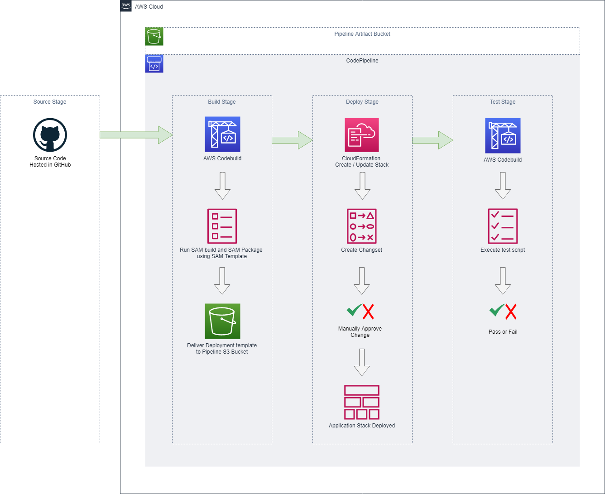

# Serverless Reference Architecture: Real-time File Processing Deployment Pipeline

The Real-time File Processing reference pipeline architecture is an example of using basic CI/CD pipeline using the AWS fully managed continuous delivery service [CodePipeline](https://aws.amazon.com/codepipeline/) in order to deploy a Serverless application. Our pipeline consists of source, build and deployment stages. 
We use exactly the same method as in the manual deployment however we utilise [CodeBuild](https://aws.amazon.com/codebuild/) to build and package our application and the native CodePipeline CloudFormation support to deploy our package.

## CI/CD Pipeline Diagram

## Pipeline Components

### CloudFormation Template

pipeline/pipeline.yml is a CloudFormation template that will deploy all the required pipeline components. Once the stack has deployed the Pipeline will automatically execute and deploy the Serverless Application. See getting started for information on how to deploy the template.

#### Deployed Resources

* Pipeline S3 bucket, used to store pipeline artefacts that are passed between stages.
* CodePipeline
* CodeBuild Project
* Roles for CodePipeline, CodeBuild and the CloudFormation Deployment

### Source

For this application we are hosting our source code in GitHub. Other [Source Integrations](https://docs.aws.amazon.com/codepipeline/latest/userguide/integrations-action-type.html#integrations-source) are available however this template focuses on GitHub. Whenever an update is pushed to the GitHub branch being
monitored our pipeline will begin executing. The source stage will connect to GitHub using the credentials provided and clone the branch into our pipeline artefact bucket for use in the other stages. 

### Build

In order to run our SAM build and SAM package commands we are using the fully managed continuous integration service [CodeBuild](https://aws.amazon.com/codebuild/) CodeBuild allows us to perform a sequence of commands that we define in the [BuildSpec.yml](https://docs.aws.amazon.com/codebuild/latest/userguide/build-spec-ref.html)
file that will execute inside the [build environment](https://docs.aws.amazon.com/codebuild/latest/userguide/build-env-ref.html) we define using a docker container. For this project we are using the Amazon Linux 2 version 1.0 container with Python 3.7.

Within the buildspec.yml we are:

* Updating SAM to the latest version
* Running SAM build as per the manual deployment
* Running SAM Package again as per the manual deployment steps
* Instructing CodeBuild to pass the output template back to the Pipeline for use in the deployment stage. 

### Deploy

To deploy our application stack we are not using SAM Deploy, instead we are opting to use CodePipelines native support for CloudFormation. The pipeline has a role it use with appropriate permissions to deploy the resources defined in our SAM Template. We are using [change sets](https://docs.aws.amazon.com/AWSCloudFormation/latest/UserGuide/using-cfn-updating-stacks-changesets.html)
and [approval actions](https://docs.aws.amazon.com/codepipeline/latest/userguide/approvals-action-add.html) to demonstrate a manual approval workflow. The first deployment will not require approval however subsequent updates will.

Additional resources will be deployed as per the main architecture documentation.

## Getting started

To get started you just need to deploy the pipeline CloudFormation stack using the template found in this repository under pipeline/pipeline.yaml in order for this to be successful you will need to provide some additional information.

  GitHubRepoName: The name of the GitHub repository hosting your source code.
 
  GitHubRepoBranch: The GitHub repo branch code pipeline should watch for changes on. This defaults to master, but any branch can be used.

  GitHubRepoOwner: the GitHub repository owner. e.g. awslabs

  GitHubToken: GitHub OAuthToken with access to be able to clone the repository. You can find more information in the [GitHub Documentation](https://github.com/settings/tokens)

  AlarmRecipientEmailAddress: You will need to provide an email address that can be used for configuring notifications

### Deploying the template

You can deploy the template using either the [AWS Console](https://docs.aws.amazon.com/AWSCloudFormation/latest/UserGuide/cfn-console-create-stack.html) or the [AWS CLI](https://docs.aws.amazon.com/AWSCloudFormation/latest/UserGuide/using-cfn-cli-creating-stack.html)

## Clean-up

In order to remove all resources created by this example you will first need to make sure the 3 S3 buckets are empty.

* Pipeline artefact bucket
* Application input bucket
* Application conversion bucket

Once that is complete you can remove both the Application Stack and the Pipeline Stack.
