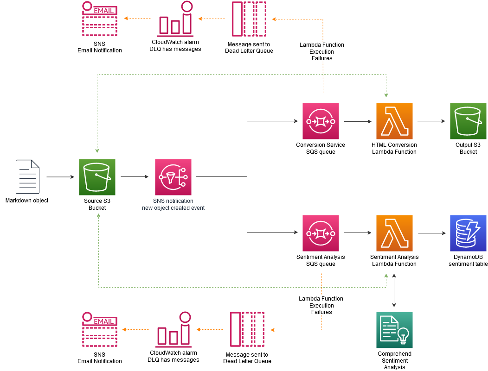

# Serverless Reference Architecture: Real-time File Processing
README Languages:  [DE](README/README-DE.md) | [ES](README/README-ES.md) | [FR](README/README-FR.md) | [IT](README/README-IT.md) | [JP](README/README-JP.md) | [KR](README/README-KR.md) |
[PT](README/README-PT.md) | [RU](README/README-RU.md) |
[CN](README/README-CN.md) | [TW](README/README-TW.md)

The Real-time File Processing reference architecture is a general-purpose, event-driven, parallel data processing architecture that uses [AWS Lambda](https://aws.amazon.com/lambda). This architecture is ideal for workloads that need more than one data derivative of an object. This simple architecture is described in this [diagram](https://s3.amazonaws.com/awslambda-reference-architectures/file-processing/lambda-refarch-fileprocessing.pdf) and ["Fanout S3 Event Notifications to Multiple Endpoints" blog post](https://aws.amazon.com/blogs/compute/fanout-s3-event-notifications-to-multiple-endpoints/) on the AWS Compute Blog. This sample application demonstrates a Markdown conversion application where Lambda is used to convert Markdown files to HTML and plain text.

## Architectural Diagram



## Running the Example

You can use the provided [AWS SAM template](https://s3.amazonaws.com/awslambda-reference-architectures/file-processing/lambda_file_processing.template) to launch a stack that demonstrates the Lambda file processing reference architecture. Details about the resources created by this template are provided in the *CloudFormation Template Resources* section of this document.

**Important** Because the AWS CloudFormation stack name is used in the name of the Amazon Simple Storage Service (Amazon S3) buckets, that stack name must only contain lowercase letters. Use lowercase letters when typing the stack name. The provided CloudFormation template retrieves its Lambda code from a bucket in the us-east-1 region. To launch this sample in another region, please modify the template and upload the Lambda code to a bucket in that region.


Choose **Launch Stack** to launch the template in the us-east-1 region in your account:

[](https://console.aws.amazon.com/cloudformation/home?region=us-east-1#/stacks/new?stackName=lambda-file-processing&templateURL=https://s3.amazonaws.com/awslambda-reference-architectures/file-processing/lambda_file_processing.template)

Alternatively, you can use the following command to launch the stack using the AWS CLI. This assumes you have already [installed the AWS CLI](http://docs.aws.amazon.com/cli/latest/userguide/installing.html).

```bash
aws cloudformation create-stack \
    --stack-name lambda-file-processing \
    --template-url https://s3.amazonaws.com/awslambda-reference-architectures/file-processing/lambda_file_processing.template \
    --capabilities CAPABILITY_IAM
```

## Using SAM

Install the dependencies for lambda

```bash
cd src/conversion && pip install -r requirements.txt -t .
cd  src/sentiment && pip install -r requirements.txt -t .
```

Run SAM package (equivalent to aws cloudformation package)

```bash
sam package \
    --template-file file_processing.yml \
    --output-template-file packaged-template.yml \
    --s3-bucket <YOUR S3 CODE BUCKET>
```


Deploy the SAM template

```bash
sam deploy \
    --template-file packaged-template.yml \
    --stack-name lambda-file-refarch \
    --capabilities CAPABILITY_IAM
```


## Testing the Example

After you have created the stack using the CloudFormation template, you can test the system by uploading a Markdown file to the InputBucket that was created in the stack. You can use this README.md file in the repository as an example file. After the file has been uploaded, you can see the resulting HTML and plain text files in the output bucket of your stack. You can also view the CloudWatch logs for each of the functions in order to see the details of their execution.

You can use the following commands to copy a sample file from the provided S3 bucket into the input bucket of your stack.

```
BUCKET=$(aws cloudformation describe-stack-resource --stack-name lambda-file-refarch --logical-resource-id InputBucket --query "StackResourceDetail.PhysicalResourceId" --output text)
aws s3 cp ./sample.md s3://$BUCKET/sample.md
```

After the file has been uploaded to the input bucket, you can inspect the output bucket to see the rendered HTML and plain text output files created by the Lambda functions.

You can also view the CloudWatch logs generated by the Lambda functions.

## Cleaning Up the Example Resources

To remove all resources created by this example, do the following:

1. Delete all objects in the input and output buckets.
1. Delete the CloudFormation stack.
1. Delete the CloudWatch log groups that contain the execution logs for the two processor functions.


## CloudFormation Template Resources

### Parameters
TBD

### Resources
[The provided template](https://s3.amazonaws.com/awslambda-reference-architectures/file-processing/lambda_file_processing.template)
creates the following resources:

- **InputBucket** - An S3 bucket that holds the raw Markdown files. Uploading a file to this bucket will trigger processing functions.

- **CloudTrailBucket** - An S3 bucket that is used to store CloudTrail data.

- **InputBucketTrail** - An CloudTrail definition that captures events put into the **CloudTrailBucket**.

- **CloudTrailBucketPolicy** - A S3 policy which permits the AWS CloudTrail service to write data to the **CloudTrailBucket**.

- **FileProcessingQueuePolicy** - A SQS policy that allows the **FileProcessingRule** to publish events to the **ConversionQueue** and **SentimentQueue**.

- **FileProcessingRule** - A CloudWatch Events Rule that monitors CloudTrail `PubObject` events from the **InputBucket**.

- **ConversionQueue** - TBD.

- **ConversionDlq** - TBD.

- **ConversionFunction** - TBD.

- **SentimentQueue** - TBD.

- **SentimentDlq** - TBD.

- **SentimentFunction** - TBD.


## License

This reference architecture sample is licensed under Apache 2.0.
